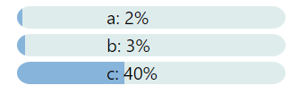

# markdown-it-progress
Progress bar plugin for markdown-it markdown parser

[](https://npmjs.org/package/markdown-it-progress)
[](https://coveralls.io/github/tlylt/markdown-it-progress?branch=main)

Example Input:
<pre><code>
```progressBar
[["a", 2], ["b", 3], ["c", 40]]
```
</code></pre>

Rendered Output:



Raw html output:
```html
<svg class="ProgressBar" style="height:25px;width: 300px;display: inline;"><g><defs><clipPath id="ProgressBar-clipPath"><rect width="100%" height="100%" rx="15px" /></clipPath></defs><rect class="ProgressBar-background" width="100%" height="100%" rx="15px" style="fill-opacity: 0.2;fill: cadetblue;"/><rect class="ProgressBar-percentage" width="2%" height="100%" clip-path="url(#ProgressBar-clipPath)" style="fill-opacity: 0.6;fill: #4c90cf;"/><text x="100" y="20" font-size="20" fill="black">a: 2%</text></g></svg><br><svg class="ProgressBar" style="height:25px;width: 300px;display: inline;"><g><defs><clipPath id="ProgressBar-clipPath"><rect width="100%" height="100%" rx="15px" /></clipPath></defs><rect class="ProgressBar-background" width="100%" height="100%" rx="15px" style="fill-opacity: 0.2;fill: cadetblue;"/><rect class="ProgressBar-percentage" width="3%" height="100%" clip-path="url(#ProgressBar-clipPath)" style="fill-opacity: 0.6;fill: #4c90cf;"/><text x="100" y="20" font-size="20" fill="black">b: 3%</text></g></svg><br><svg class="ProgressBar" style="height:25px;width: 300px;display: inline;"><g><defs><clipPath id="ProgressBar-clipPath"><rect width="100%" height="100%" rx="15px" /></clipPath></defs><rect class="ProgressBar-background" width="100%" height="100%" rx="15px" style="fill-opacity: 0.2;fill: cadetblue;"/><rect class="ProgressBar-percentage" width="40%" height="100%" clip-path="url(#ProgressBar-clipPath)" style="fill-opacity: 0.6;fill: #4c90cf;"/><text x="100" y="20" font-size="20" fill="black">c: 40%</text></g></svg>
```

## Install

```
$ npm install --save markdown-it-progress
```
Or
```
$ yarn add markdown-it-progress
```

## Usage
```
var md = require('markdown-it')();
var markdownItProgress = require('markdown-it-progress');

md.use(markdownItProgress, {
  // optional, these are default options
  render: 'svg'
});

var src = '```progressBar\n[["a", 2]]\n```';
var res = md.render(src);

console.log(res);
```