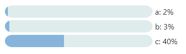

# markdown-it-progress
Progress bar plugin for markdown-it markdown parser

[](https://npmjs.org/package/markdown-it-progress)
[](https://coveralls.io/github/tlylt/markdown-it-progress?branch=main)

Example input:
<pre><code>
```progressBar
[["a", 2], ["b", 3], ["c", 40]]
```
</code></pre>

Rendered output:



Raw HTML output:
```html
<div class="ProgressBar" style="display:flex;padding-bottom:5px;"><svg class="ProgressBar-svg" style="height:25px;width:300px;"><defs><clipPath id="ProgressBar-clipPath"><rect width="100%" height="100%" rx="15px" /></clipPath></defs><rect class="ProgressBar-background" width="100%" height="100%" rx="15px" style="fill-opacity:0.2;fill:cadetblue;"/><rect class="ProgressBar-percentage" width="2%" height="100%" clip-path="url(#ProgressBar-clipPath)" style="fill-opacity:0.6;fill:#4c90cf;"/></svg><span style="padding-left:5px;align-self:center;">a: 2%</span></div><div class="ProgressBar" style="display:flex;padding-bottom:5px;"><svg class="ProgressBar-svg" style="height:25px;width:300px;"><defs><clipPath id="ProgressBar-clipPath"><rect width="100%" height="100%" rx="15px" /></clipPath></defs><rect class="ProgressBar-background" width="100%" height="100%" rx="15px" style="fill-opacity:0.2;fill:cadetblue;"/><rect class="ProgressBar-percentage" width="3%" height="100%" clip-path="url(#ProgressBar-clipPath)" style="fill-opacity:0.6;fill:#4c90cf;"/></svg><span style="padding-left:5px;align-self:center;">b: 3%</span></div><div class="ProgressBar" style="display:flex;padding-bottom:5px;"><svg class="ProgressBar-svg" style="height:25px;width:300px;"><defs><clipPath id="ProgressBar-clipPath"><rect width="100%" height="100%" rx="15px" /></clipPath></defs><rect class="ProgressBar-background" width="100%" height="100%" rx="15px" style="fill-opacity:0.2;fill:cadetblue;"/><rect class="ProgressBar-percentage" width="40%" height="100%" clip-path="url(#ProgressBar-clipPath)" style="fill-opacity:0.6;fill:#4c90cf;"/></svg><span style="padding-left:5px;align-self:center;">c: 40%</span></div>
```

Formatted version of the HTML above:
```html
<div class="ProgressBar" style="display:flex;padding-bottom:5px;">
   <svg class="ProgressBar-svg" style="height:25px;width:300px;">
      <defs>
         <clipPath id="ProgressBar-clipPath">
            <rect width="100%" height="100%" rx="15px" />
         </clipPath>
      </defs>
      <rect class="ProgressBar-background" width="100%" height="100%" rx="15px" style="fill-opacity:0.2;fill:cadetblue;"/>
      <rect class="ProgressBar-percentage" width="2%" height="100%" clip-path="url(#ProgressBar-clipPath)" style="fill-opacity:0.6;fill:#4c90cf;"/>
   </svg>
   <span style="padding-left:5px;align-self:center;">a: 2%</span>
</div>
<div class="ProgressBar" style="display:flex;padding-bottom:5px;">
   <svg class="ProgressBar-svg" style="height:25px;width:300px;">
      <defs>
         <clipPath id="ProgressBar-clipPath">
            <rect width="100%" height="100%" rx="15px" />
         </clipPath>
      </defs>
      <rect class="ProgressBar-background" width="100%" height="100%" rx="15px" style="fill-opacity:0.2;fill:cadetblue;"/>
      <rect class="ProgressBar-percentage" width="3%" height="100%" clip-path="url(#ProgressBar-clipPath)" style="fill-opacity:0.6;fill:#4c90cf;"/>
   </svg>
   <span style="padding-left:5px;align-self:center;">b: 3%</span>
</div>
<div class="ProgressBar" style="display:flex;padding-bottom:5px;">
   <svg class="ProgressBar-svg" style="height:25px;width:300px;">
      <defs>
         <clipPath id="ProgressBar-clipPath">
            <rect width="100%" height="100%" rx="15px" />
         </clipPath>
      </defs>
      <rect class="ProgressBar-background" width="100%" height="100%" rx="15px" style="fill-opacity:0.2;fill:cadetblue;"/>
      <rect class="ProgressBar-percentage" width="40%" height="100%" clip-path="url(#ProgressBar-clipPath)" style="fill-opacity:0.6;fill:#4c90cf;"/>
   </svg>
   <span style="padding-left:5px;align-self:center;">c: 40%</span>
</div>
```


## Install

```
$ npm install --save markdown-it-progress
```
Or
```
$ yarn add markdown-it-progress
```

## Usage
```
var md = require('markdown-it')();
var markdownItProgress = require('markdown-it-progress');

md.use(markdownItProgress, {
  // optional, these are default options
  render: 'svg'
});

var src = '```progressBar\n[["a", 2]]\n```';
var res = md.render(src);

console.log(res);
```